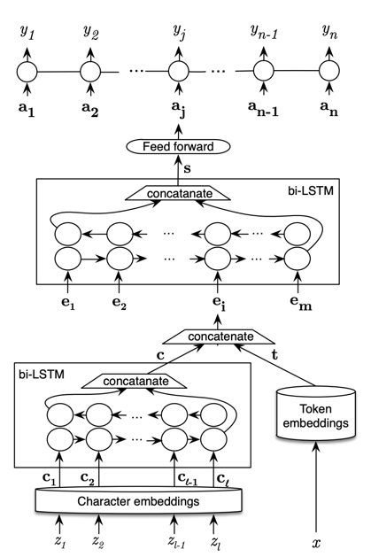

# MedNLPify-Chrome-Extension
MedNLPify is a Chrome extension and NLP tool that simplifies the language of medical research abstracts to make them
more readable and accessible to non-experts and medical practitioners alike. It replicates and builds on the approach 
introduced in the paper <a href="https://arxiv.org/pdf/1612.05251">PubMed 200k RCT: a Dataset for Sequential Sentence Classification in Medical Abstracts</a>, 
using a trained NLP model to tag and classify sentences in medical abstracts.

 🚀Features
* Classifies sentences in medical abstracts into logical sections (e.g., Background, Objective, Method, Result, Conclusion).

* Enhances readability by helping users understand the structure and flow of research papers.

*  Chrome extension integration for real-time simplification of abstracts on PubMed or similar research databases.

* Powered by NLP and Deep Learning using TensorFlow 

**Model Architecture**

1. Create a token-level model (similar to model_1)

2. Create a character-level model (similar to model_3 with a slight modification to reflect the paper)

3. Create a "line_number" model (takes in one-hot-encoded "line_number" tensor and passes it through a non-linear layer)

4. Create a "total_lines" model (takes in one-hot-encoded "total_lines" tensor and passes it through a non-linear layer)

5. Combine (using layers.Concatenate) the outputs of 1 and 2 into a token-character-hybrid embedding and pass it series of output to Figure 1 and section 4.2 of Neural Networks for Joint Sentence Classification in Medical Paper Abstracts
6. Combine (using layers.Concatenate) the outputs of 3, 4 and 5 into a token-character-positional tribrid embedding
7. Create an output layer to accept the tribrid embedding and output predicted label probabilities
8. Combine the inputs of 1, 2, 3, 4 and outputs of 7 into a tf.keras.Model

