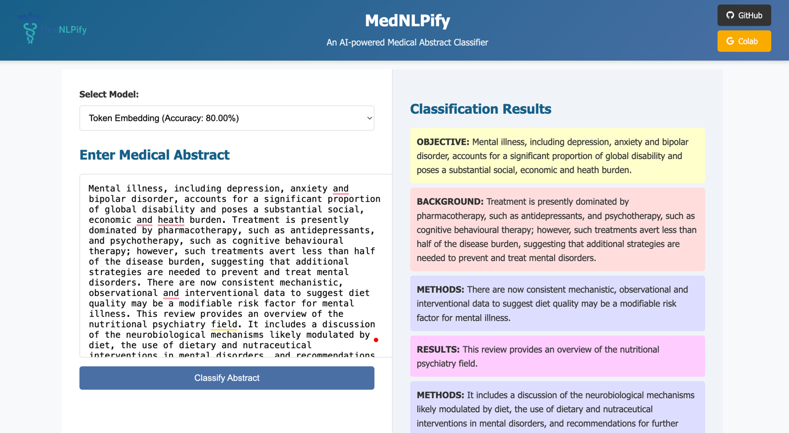
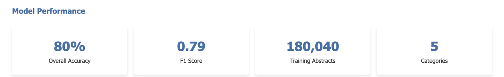
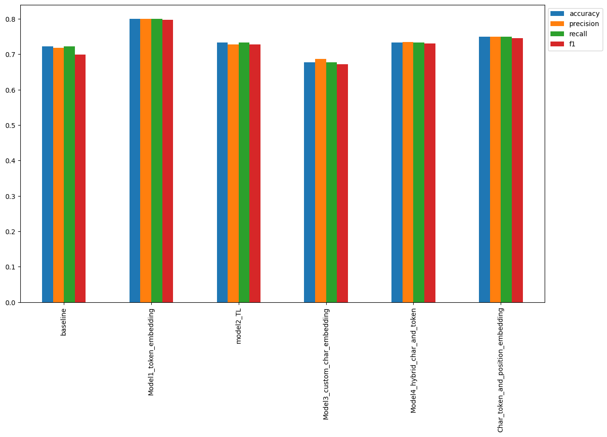

<!-- PROJECT LOGO -->
 

  

  <h3 align="center">MedNLPify</h3>

  

    An AI-powered Medical Abstract Classifier
     
    <a href="https://github.com/Prashanna-Raj-Pandit/FootBalance-Nepal/tree/main/static/files"><strong>Checkout the models »</strong></a>
     
     
  

<!-- ABOUT THE PROJECT -->
## About The Project

MedNLPify is a Chrome extension and NLP tool that simplifies the language of medical research abstracts to make them
more readable and accessible to non-experts and medical practitioners alike. It replicates and builds on the approach 
introduced in the paper <a href="https://arxiv.org/pdf/1612.05251">PubMed 200k RCT: a Dataset for Sequential Sentence Classification in Medical Abstracts</a>, 
using a trained NLP model to tag and classify sentences in medical abstracts.

 🚀Features
* Classifies sentences in medical abstracts into logical sections (e.g., Background, Objective, Method, Result, Conclusion).
* Enhances readability by helping users understand the structure and flow of research papers.
*  Chrome extension integration for real-time simplification of abstracts on PubMed or similar research databases.
* Powered by NLP and Deep Learning using TensorFlow 

### Built With

  
  
  
  
  
  

### Model Architecture

  
  

1. Create a token-level model (similar to model_1)
2. Create a character-level model (similar to model_3 with a slight modification to reflect the paper)
3. Create a "line_number" model (takes in one-hot-encoded "line_number" tensor and passes it through a non-linear layer)
4. Create a "total_lines" model (takes in one-hot-encoded "total_lines" tensor and passes it through a non-linear layer)
5. Combine (using layers.Concatenate) the outputs of 1 and 2 into a token-character-hybrid embedding and pass it series of output to Figure 1 and section 4.2 of Neural Networks for Joint Sentence Classification in Medical Paper Abstracts
6. Combine (using layers.Concatenate) the outputs of 3, 4 and 5 into a token-character-positional tribrid embedding
7. Create an output layer to accept the tribrid embedding and output predicted label probabilities
8. Combine the inputs of 1, 2, 3, 4 and outputs of 7 into a tf.keras.Model

**Model Comparison**
</img>
<!-- CONTRIBUTING -->
## Contributing

If you have a suggestion that would make this better, please fork the repo and create a pull request. You can also simply open an issue with the tag "enhancement".
Don't forget to give the project a star! Thanks again!

1. Fork the Project
2. Create your Feature Branch (`git checkout -b feature/AmazingFeature`)
3. Commit your Changes (`git commit -m 'Add some AmazingFeature'`)
4. Push to the Branch (`git push origin feature/AmazingFeature`)
5. Open a Pull Request

## References
1. PubMed 200k RCT: A Dataset for Sequential Sentence Classification in Medical Abstracts
* Authors: Franck Dernoncourt, Ji Young Lee
* arXiv: https://arxiv.org/abs/1710.06071
* GitHub: https://github.com/Franck-Dernoncourt/pubmed-rct

2. mrdbourke-tensorflow-deep-learning